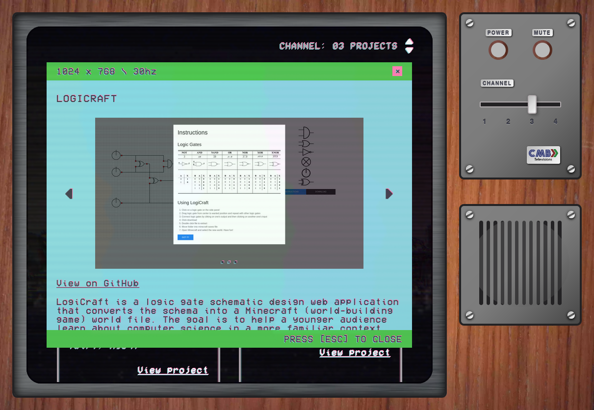

# [Campbellmb.com](https://campbellmb.com)

My personal portfolio / digital resume. A unique application that is themed after a 60's era Television.

See [ARCHITECTURE.md](ARCHITECTURE.md) for folder ownership, component/page
boundaries, routing, state, and guidance for extending the application.
The [design direction](DESIGN.md) records how to refine the interface while
preserving its CRT character.

  


## Running the app

Use Node.js 24 or newer and pnpm 12.4.2 (pinned in `package.json`). With nvm and Corepack:

```bash
nvm use
corepack enable
pnpm install --frozen-lockfile
```

Run the development server:

```bash
pnpm dev
```

Open [http://localhost:3000](http://localhost:3000) with your browser to see the result.

## Validation

```bash
pnpm lint
pnpm typecheck
pnpm build
pnpm exec playwright install chromium firefox webkit
pnpm test:e2e
```

The browser suite starts the production build on port 3100 and checks navigation,
modal deep links/history, carousels, TV controls, media, responsive layouts, and
404 recovery in Chromium, Firefox, desktop WebKit, and mobile WebKit. Rebuild
before running it after application changes. Screenshots and traces are retained
for failures in `test-results/`.

## Tooling compatibility

Type checking uses TypeScript 7.0.2. The `typescript` dependency aliases
`@typescript/typescript6` for tools that still require the JavaScript compiler API;
`@typescript/native` aliases TypeScript 7 and supplies `tsc`. This follows
[Microsoft's side-by-side setup](https://devblogs.microsoft.com/typescript/announcing-typescript-7-0/#running-side-by-side-with-typescript-6.0).

ESLint 10 uses the TypeScript ESLint parser and
[`@eslint/compat`](https://eslint.org/blog/2024/05/eslint-compatibility-utilities/)
for Next's plugins that still use older ESLint APIs. pnpm may report their older
ESLint peer ranges; lint runs with all Next core-web-vitals rules enabled.

The development route indicator is disabled to avoid a Next 16.3.5 Pages Router
initialization race. Compile and runtime error reporting remains enabled.
